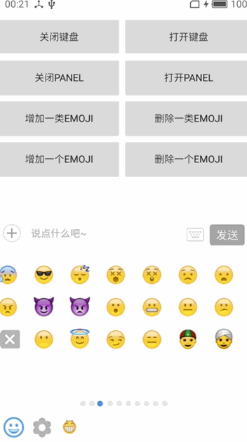
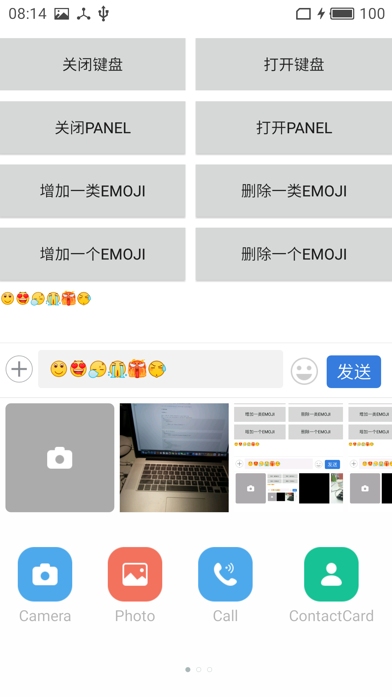

# EasyEmoji
Add emoji so easy

让你的App添加表情最简单，最快速，并且无需更改原有activity布局。



可自由扩展面板功能：



可自由扩展emoji表情功能：


## Download

**Gradle:**

Step 1. Add the JitPack repository to your build file
Add it in your root build.gradle at the end of repositories:
```xml
    allprojects {
        repositories {
            ...
            maven { url 'https://jitpack.io' }
        }
    }
```

Step 2. Add the dependency
```xml
    dependencies {
            compile 'com.github.nickyangjun:EasyEmoji:1.3.4'
    }
```

Or Maven:
```xml
    <repositories>
        <repository>
            <id>jitpack.io</id>
            <url>https://jitpack.io</url>
        </repository>
    </repositories>

    <dependency>
        <groupId>com.github.nickyangjun</groupId>
        <artifactId>EasyEmoji</artifactId>
        <version>1.3.4</version>
    </dependency>
```


## How do I use Glide?

Step 1. Replace you editText and TextView to support the emoji

使用EmojiconEditText和EmojiconTextView替换原有布局中的EditText和TextView，以支持emoji表情

EmojiconEditText：
```xml
        <org.nicky.libeasyemoji.emojicon.EmojiconEditText 
            xmlns:Emojicon="http://schemas.android.com/apk/res-auto"
            android:id="@+id/emoji_input_txt"
            android:layout_width="match_parent"
            android:layout_height="wrap_content"
            android:layout_marginLeft="35dp"
            android:layout_marginRight="100dp"
            android:background="@drawable/shape_input_text"
            android:hint="说点什么吧~"
            android:lineSpacingExtra="1dp"
            android:maxLength="140"
            android:maxLines="4"
            android:minHeight="35dp"
            android:paddingLeft="10dp"
            android:paddingRight="10dp"
            android:textColor="@color/black"
            android:textColorHint="@color/hint_gray_999"
            android:textSize="14sp"
            Emojicon:emojiconSize="18sp" />
```

EmojiconTextView:
```xml
        <org.nicky.libeasyemoji.emojicon.EmojiconTextView
            android:id="@+id/emoji_txt"
            android:layout_width="match_parent"
            android:layout_height="50dp" />
```

Step 2. Get EasyInputManager instance and add default Emoji in your activity，now joyful.

在activity里获取EasyInputManager实例并且添加默认支持的emoji,现在你可以愉快使用emoji啦

```java
    mEasyInputManager = EasyInputManagerImpl.newInstance(this);
    mEasyInputManager.addDefaultEmoji("emoji",emojiconEditText);
```


<br>
<br>

### More features can refer to the demo.

Add Panel and Keyboard listener
增加panel和键盘弹出监听
```java
mEasyInputManager.addOnPanelListener(new changePanelListener());
mEasyInputManager.addOnKeyboardIMEListener(new changeKeyboardListener());
```

Touch blank erea to display keyboard
点击空白区域自动隐藏键盘
```java
mEasyInputManager.setTouchBlankAutoHideIME(true,dip2px(this, 50));
```

Add custom fragment to panel area
增加自定义界面到panel区域
```java
mEasyInputManager.addFragmentToPanel("attach", AttachFragment.newInstance());

//open panel
mEasyInputManager.openPanel();
//open "attach" panel
mEasyInputManager.openPanel("attach");

//close panel
mEasyInputManager.closePanel();

```


Add custom expressions
增加自定义表情
```java
//add
mEasyInputManager.getEmojiBuilder().addEmojiStyle(lovedEmoji);
 
//update
mEasyInputManager.getEmojiBuilder().updateEmojiStyle(lovedEmoji);
```


**为了更好的完善此框架，希望更多对此框架有兴趣的朋友一起加入进来打造更易用更完善的EasyEmoji,欢迎star!!!**
